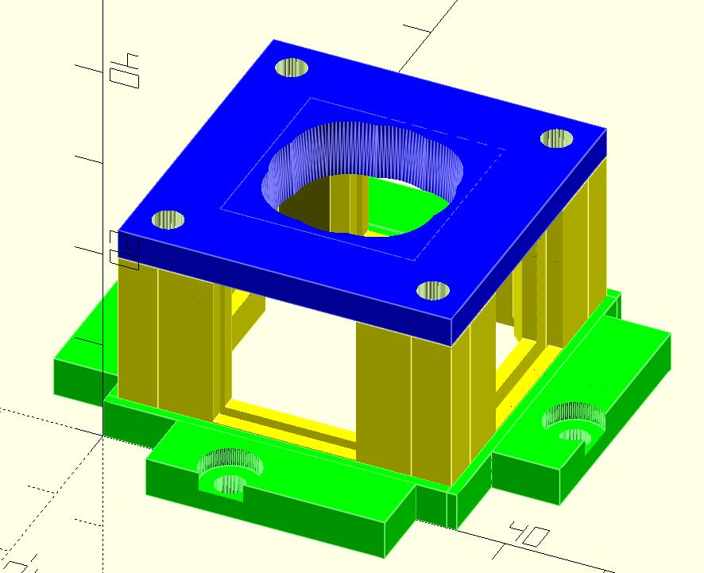

# Arcade Key Switch MOD

This repository contains the 3D models needed to mount common keyboard
mechanical switches on commercial Arcade Sticks. It was designed for the
Seimitsu LS-56 stick, however the models are parametric so we hope you can
easly adapt to other sticks.

# Feature

- Seimitsu LS-56 support out-of-the-box.

- Easly tweakable (we hope)

- Short thtow and engage (similar to 5mm Kowal plate modification for the LS-56)

- Four type of gate: rond-based, square, octogonal and diamond. The latter is
  a mix of the the square and octogonal ones, configurable with a single simple
  parameter.

# Compiling the models

In this repository you will find the OpenSCAD[^1] sources of
the models. The final `stl` models are also avaiable in the release pages,
however for any changes over the default configuration, you need to modify the
source and recompile it. It is very simple, please refer to the OpenSCAD[^1]
documentation.

For a quick overview of the source, mounting instructions, etc, please refere to
the [documentation](doc/doc.md) in this repository.

[^1]: https://openscad.org

