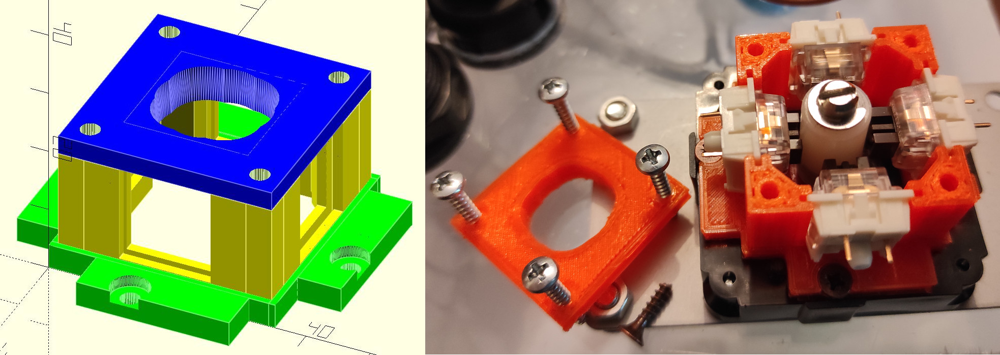

# Arcade Key Switch MOD Documantation

WORK IN PROGRESS! Sorry, still nothing here. I hope to add soon some info on:

- How to mount the MOD on a Seimitsu LS-56

- How to change Throw and Engage

- How to change to one of the supported gate shapes

- Adapt to slighty different switches

- Adapt to other sticks

